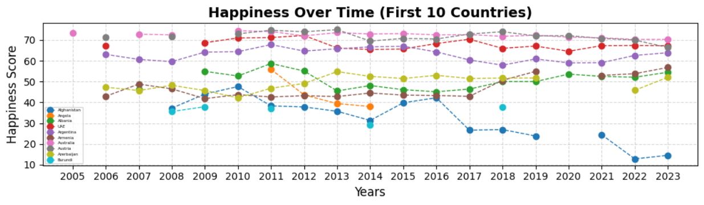

# 📈 Task 4: Line Chart - Happiness Score
## 📌 Overview  
This task involves creating a multi-line chart to visualize the different countries happiness trends. 

---

## 📂 Files in this Folder

| File Name         | Description                                    |
|------------------|--------------------------------|
| solution.ipynb | Jupyter Notebook with the code for visualization |
| data.xlsx       | Dataset containing life expectancy values by year |
| output.png     | Screenshot of the generated line chart |

---

## 📜 Steps to Recreate the Chart
1️⃣ Load the dataset (data.xlsx) into Python using Pandas.  
2️⃣ Use Matplotlib/Seaborn to plot the line chart.  
3️⃣ Label axes and add a title for clarity.  

---

## 📷 Screenshot of the Chart

---

## 🛠 How to Run the Code
1. Open the solution.ipynb Jupyter Notebook.
2. Run all cells to generate the visualization.

---

🔗 For further improvements, consider adding trend lines or comparing different regions.
